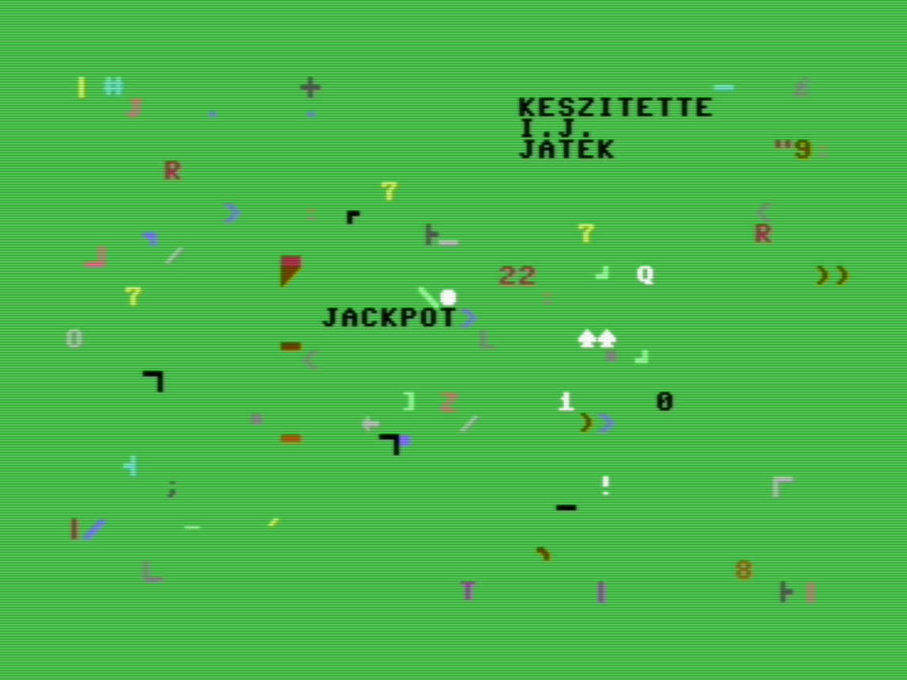

# JACKPOT
Copyright 1996



- - - - - -

## What is this

I ran into a cassette at my parent's house. Based on the label it contained a
single COMMODORE 64 program I wrote long ago. As a 9 year old. I'm guessing the
age based on the music that is on it next to the program.


I'm pretty sure I wrote this with pen and paper then typed it in.


## Is it good?

The program generates 3 random numbers, each between 0 and 5 and it
congratulates you if they all match.

## How to run

Use [VICE](https://vice-emu.sourceforge.io/) Commodore emulator to convert the
source file to a program and run it with the emulator.

```
petcat -w2 -o jackpot.prg -- jackpot.bas
```

Then run it:

```
x64 jackpot.prg
```

## Getting it off the tape

I bought a Renkforce RF-CP-170 USB audio casestte digitizer. Looks like a cheap
walkman with a mini USB connector, shows up as a USB soundcard in Linux, no extra
software needed.

I started Audacity pressed record then PLAY on the walkman and fiddled with the
volume slider to get a loud signal. I cut out the beeps into a mono wav file.


After quick search I downloaded the Windows version of
[Audiotap](https://wav-prg.sourceforge.io/audiotap.html ), ran it with wine and
converted the wav file to a tap file. Tried to load this into VICE the C64
emulator, but no luck so I tried another program
[ubercassette](https://github.com/DusteDdk/ubercassette). This time the
resulting .tap file was loaded successfully into the emulator and I could play
with it.  I was surprised it was this easy. I was expecting more problems and fiddling
with the wav to be honest.

Now I need to get the BASIC program out of the emulator. I couldn't find a program that
processed tape files directly but  I found programs working with floppy disk images.
I had the idea to save the program to an empty disk image:

```
LOAD
PRESS PLAY ON TAPE

SEARCHING
FOUND JACKPOT
LOADING
READY.

SAVE "JACKPOT",8
```

Now I have a .d64 disk image file that contains the program. The VICE emulator ships
with tools that can extract the data and convert it to ASCII characters.

```
$ c1541 -attach jackpot.diskimage.d64 -extract
$ petcat jackpot > jackpot.bas
```
